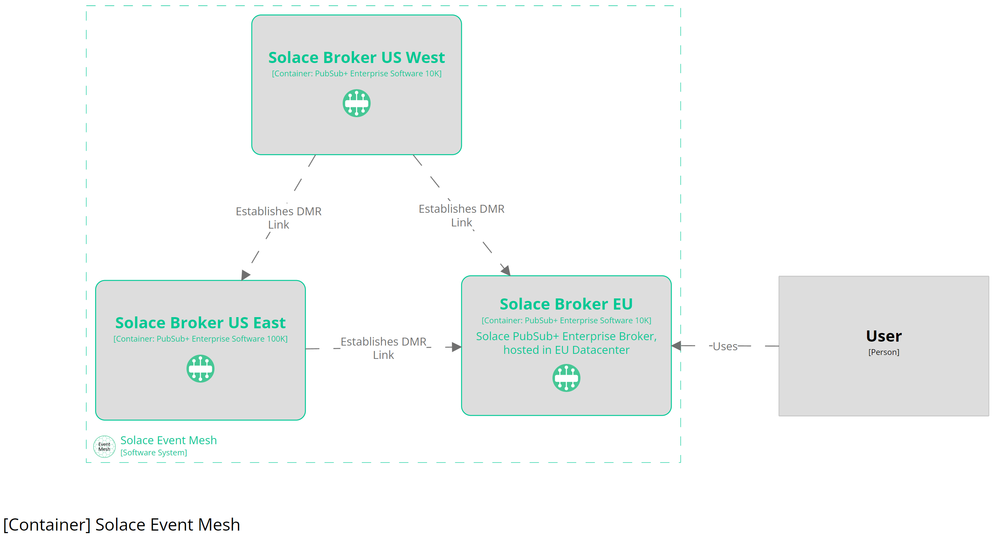

# Structurizr Theme for Solace EDA Architectural Diagrams

This repository hosts a visual theme for Structurizr (https://structurizr.com/) based on the amazing 
Solace EDA Icons for architectural diagrams found at https://solace.com/solace-eda-icons/

:warning: __The content of the theme is very limited by now and does only contain a very small number
of styles.__ :warning: <br/>
We're happy to accept your contributions and suggestions!

## Usage

To use the theme in your structurizr DSL, include the url `https://andreas-habel.github.io/github-pages/solace-structurizr-theme/theme.json` as a `theme`.

You can also preview the theme in the structurizr [:link: theme browser](https://structurizr.com/help/theme?url=https://andreas-habel.github.io/github-pages/solace-structurizr-theme/theme.json).

``` coffee
workspace {

    model {
        ...
    }

    views {
        theme "https://andreas-habel.github.io/github-pages/solace-structurizr-theme/theme.json"

        systemLandscape {
            include *
            autoLayout lr
        }
    }
}
    
```

## Example

In the `exmaples` directory, you can find an example with `workspace.dsl` and `workspace.json` 
which you can view with [:link: Structurizr Lite](https://docs.structurizr.com/lite)
The Container view would look like this




## Disclaimer

All icons used for this theme are made and provided by Solace.com (https://solace.com/solace-eda-icons/). 

This repository is not officially supported by Solace. 
